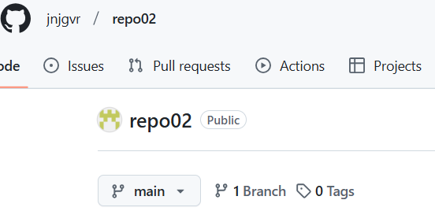
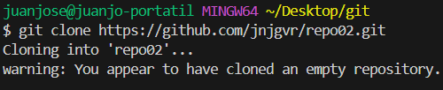
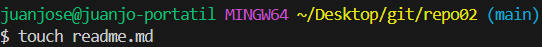
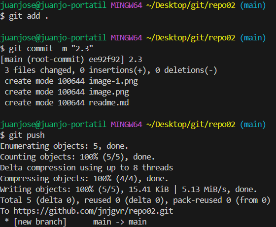
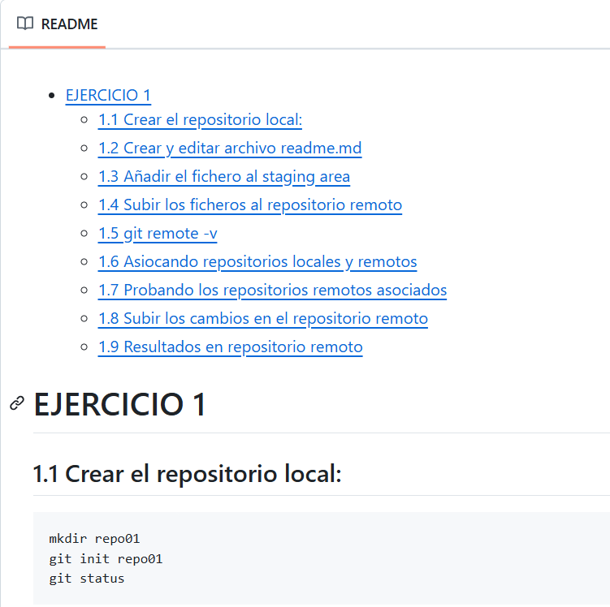

# EJERCICIO 2
## 2.1 Crear el repositorio remoto en github

## 2.2 Clonar el repositorio remoto en visual studio

## 2.3 Crear readme.md y realizar commits

## 2.4 Realizar documentacion markdown
[Ejercicio 1](https://github.com/jnjgvr/repo01)
